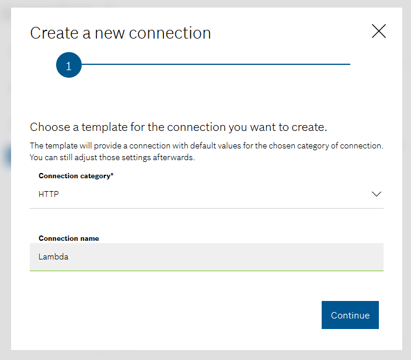
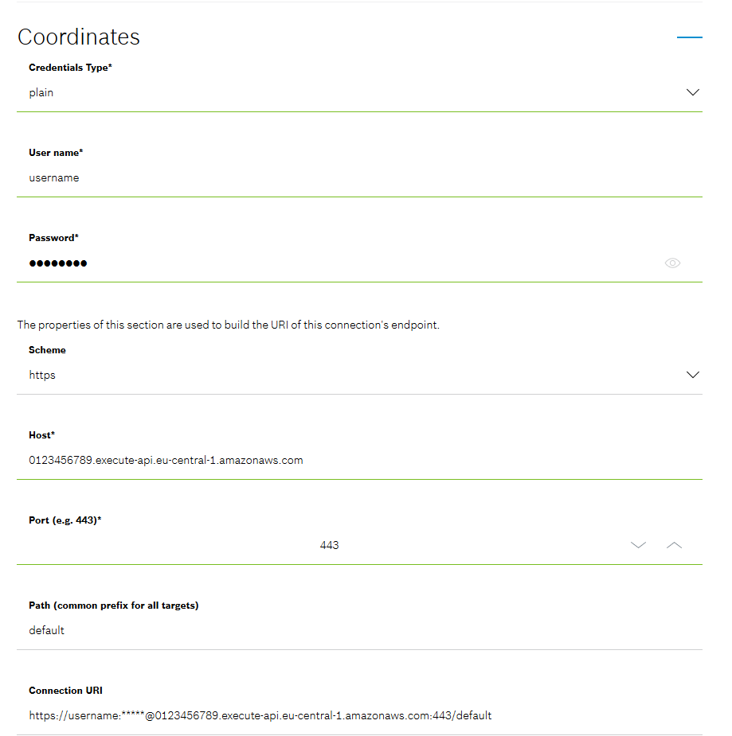
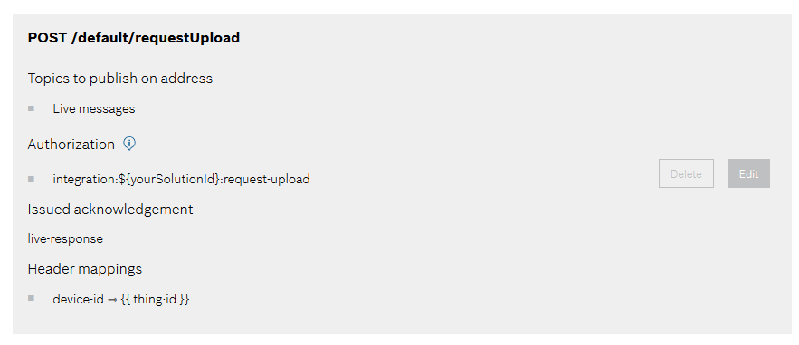
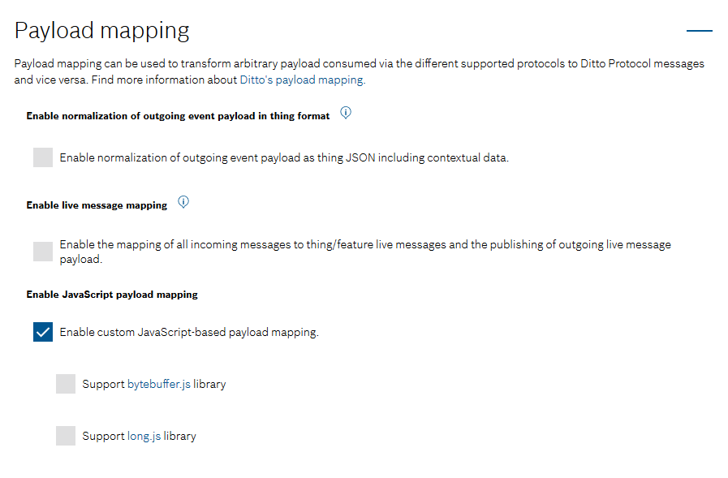

# File Upload by device

This example shows how to enable a device to upload files to an AWS S3 Bucket without the need of the device to know
about AWS. The device authentication is guaranteed by the Bosch IoT Hub and all the device needs to know about the S3
bucket is a [pre-signed URL](https://docs.aws.amazon.com/AmazonS3/latest/userguide/ShareObjectPreSignedURL.html) which
is provided by a generic command that is sent to the device.

## Architecture

TODO: Add image and short description here.

## Vorto Model

This is a simple Vorto model which defines a stateless process for uploading files.

```
vortolang 1.0
namespace vorto.private.poc.blob.upload
version 1.0.0
displayname "BLOBUpload"
description "Functionblock for BLOBUpload"

functionblock BLOBUpload {

  events {

    requestUpload {
      blobId as string
      blobType as string
      additionalInfo as dictionary[string, string]
    }

    success {
      blobId as string
      uploadURL as string
      additionalInfo as dictionary[string, string]
    }

    failed {
      blobId as string
      errorCode as string
      errorMessage as string
      additionalInfo as dictionary[string, string]
    }

    progress {
      blobId as string
      progressInfo as string
      additionalInfo as dictionary[string, string]
    }

  }

  operations {
     triggerUpload(blobId as string, uploadURL as string, additionalInfo as dictionary[string, string]) "Device should perform the upload to specified upload endpoint"
  }
}
```

## AWS Lambda

To provide a pre-signed URL to the device we create an AWS Lambda which handles an HTTP POST request containing the
payload of the `requestUpload` event. In our example we use `application/json` payload.

Let's assume the following payload:

```
{
    "blobId": "sample.png",
    "blobType": "PNG",
    "additionalInfo": {}
}
```

The Lambda will respond with the payload of the `triggerUpload` operation.

```
{
    "uploadURL": "https://file-upload.s3.eu-central-1.amazonaws.com/...",
    "blobId": "foo",
    "additionalInfo": {}
}
```

TODO: Add Lambda Code

## Configuration in IoT Things

Now that we have the Lambda, it's time to interact with it. In the following we'll provision a new device and create an
HTTP Webhook to the AWS Lambda. The last step will be to configure a payload mapping in the connection to IoT Hub which
will transform the response of the AWS Lambda into a`triggerUpload` operation.

### Provision the Device

To provision the device follow the [Provision a Linux-based device](https://docs.bosch-iot-suite.com/edge/index.html#110336.htm) steps from [Bosch IoT Edge documentation](https://docs.bosch-iot-suite.com/edge/#108408.htm).

#### Policy

In Bosch IoT Things the `requestUpload` event is modelled as live message according to
the [documentation](https://docs.bosch-iot-suite.com/asset-communication/Specification-digital-twin-model-mapping.html#src-1352239526_Specificationdigitaltwinmodelmapping-Digitaltwinfacetevents)
.

This message will be sent by the device and needs to be published to the AWS Lambda. This means that we should configure
an additional entry in the Policy of the Device we just provisioned. This could for example be done by using
the [HTTP API of Bosch IoT Things](https://apidocs.bosch-iot-suite.com/?urls.primaryName=Bosch%20IoT%20Things%20-%20API%20v2#/Policies/put_policies__policyId__entries__label_)
. In this example we add an entry called `REQUEST_UPLOAD` which looks like this (please replace `${yourSolutionId}` with
ID of your Bosch IoT Things Solution):

```
{
    "subjects": {
        "integration:${yourSolutionId}:request-upload": {
            "type": "request-upload live message"
        }
    },
    "resources": {
        "message:/features/BLOBUpload/outbox/messages/requestUpload": {
            "grant": [
                "READ"
            ],
            "revoke": []
        }
    }
}
```

### Webhook to the AWS Lambda

The Webhook to the Lambda can be established by configuring an HTTP connection within Bosch IoT Things.

1. Create a new HTTP connection and give it some expressive name. In this case we've chosen "Lambda".
   
2. Configure the connection with the URL and credentials of your Lambda.
   
3. Add a target which uses HTTP POST to publish Live messages to the `/requestUpload` endpoint of your Lambda. Use the
   authorization subject we defined in the Policy Entry earlier (`integration:${yourSolutionId}:request-upload`). To
   provide the `device-id` header with the correct ID of the device specify a header
   mapping `device-id ⇾ {{ thing:id }}`.
   
4. Last but not least we need to enable the live message mapping. This will extract the payload of the live message and
   publishes only the payload to the Lambda.
   

### IoT Hub Connection
The IoT Hub Connection is the channel where Bosch IoT Things receives messages sent from the device and publishes messages to the device.
In order to make the response of the AWS lambda look like a `triggerUpload` operation, it's required to add a custom JavaScript-based payload mapping.
Please edit the Connection with the name `Devices via Bosch IoT Hub` which should be created automatically, after booking a Device Management Package of the Bosch IoT Suite.


The incoming script expects the messages to already be in Ditto Protocol format. It parses both, textual payload or binary payload, as Ditto Protocol message.

```
/**
 * Maps the passed parameters to a Ditto Protocol message.
 * @param {Object.<string, string>} headers - The headers Object containing all received header values
 * @param {string} [textPayload] - The String to be mapped
 * @param {ArrayBuffer} [bytePayload] - The bytes to be mapped as ArrayBuffer
 * @param {string} [contentType] - The received Content-Type, e.g. "application/json"
 * @returns {(DittoProtocolMessage|Array<DittoProtocolMessage>)} dittoProtocolMessage(s) -
 *  The mapped Ditto Protocol message,
 *  an array of Ditto Protocol messages or
 *  <code>null</code> if the message could/should not be mapped
 */
function mapToDittoProtocolMsg(
  headers,
  textPayload,
  bytePayload,
  contentType
) {

  let dittoProtocolMsg = null;
  if (contentType === 'application/vnd.eclipse.ditto+json') {
    // Used if a ditto protocol message is sent as text payload.
    dittoProtocolMsg = JSON.parse(textPayload);
  } else if (contentType === 'application/octet-stream') {
    // Used if a ditto protocol message is sent as binary payload.
    dittoProtocolMsg = JSON.parse(Ditto.arrayBufferToString(bytePayload));
  }
  // If not if-clause matched, the message is still be null and will be dropped.
  return dittoProtocolMsg;
}
```

The script for outgoing messages adds a special handling for the response to the `requestUpload` message. It transforms the response to a `triggerUpload` live message.
```
/**
 * Maps the passed parameters which originated from a Ditto Protocol message to an external message.
 * @param {string} namespace - The namespace of the entity in java package notation, e.g.: "org.eclipse.ditto"
 * @param {string} id - The ID of the entity
 * @param {string} channel - The channel for the signal, one of: "twin"|"live"
 * @param {string} group - The affected group/entity, one of: "things"
 * @param {string} criterion - The criterion to apply, one of: "commands"|"events"|"search"|"messages"|"errors"
 * @param {string} action - The action to perform (one of: "create"|"retrieve"|"modify"|"delete"),
 * or the subject of a message
 * @param {string} path - The path which is affected by the message (e.g.: "/attributes"), or the destination
 * of a message (e.g.: "inbox"|"outbox")
 * @param {Object.<string, string>} dittoHeaders - The headers Object containing all Ditto Protocol header values
 * @param {*} [value] - The value to apply / which was applied (e.g. in a "modify" action)
 * @param {number} status - The status code that indicates the result of the command.
 * @param {Object} extra - The enriched extra fields when selected via "extraFields" option.
 * @returns {(ExternalMessage|Array<ExternalMessage>)} externalMessage -
 *  The mapped external message,
 *  an array of external messages or
 *  <code>null</code> if the message could/should not be mapped
 */
function mapFromDittoProtocolMsg(
  namespace,
  id,
  group,
  channel,
  criterion,
  action,
  path,
  dittoHeaders,
  value,
  status,
  extra
) {

  let dittoProtocolMessage;  

  if(action === "requestUpload") {
    // Transform the response of a "requestUpload" message to a "triggerUpload" operation.
    let newAction = "triggerUpload";
    let newPath = "/features/BLOBUpload/inbox/messages/triggerUpload";
    let newDittoHeaders = {
      'x-things-parameter-order' : dittoHeaders['x-things-parameter-order']
    };
    let newStatus = undefined; // Initialize with undefined to avoid having a status in the "triggerUpload" message
    dittoProtocolMessage = Ditto.buildDittoProtocolMsg(namespace, id, group, channel, criterion, newAction, newPath, newDittoHeaders, value, newStatus, extra);
  } else {
    dittoProtocolMessage = Ditto.buildDittoProtocolMsg(namespace, id, group, channel, criterion, action, path, dittoHeaders, value, status, extra);
  }
 
  let headers = {};
  let textPayload = JSON.stringify(dittoProtocolMessage);
  let bytePayload = null;
  let contentType = 'application/vnd.eclipse.ditto+json';

  return Ditto.buildExternalMsg(headers, textPayload, bytePayload, contentType);
}
```
## Device

On the device we have a Go program ([blob-upload.go](src/device/blob-upload.go)) that imlements the BLOBUpload Vorto feature. It communicates with the IoT Hub through the local MQTT broker of the Edge Agent. 

The program demonstrates the simplest use case - it sends a 'requestUpload' message for a single file specified with the '-f' command-line flag and listens for the 'triggerUpload' response. Upon receiving it, the provided pre-signed URL is used to upload the file, after which the program exits. Adding events for upload progress, success or failure is left as an exercise for the reader.

[Eclipse Ditto Client SDK for Golang](https://github.com/eclipse/ditto-clients-golang) is used for communication over the Ditto protocol.

### Usage

To run/build the program [Go](https://golang.org/doc/install) v1.15+ is required.

Execute the following command in [src/device](src/device) directory to run the program:

```
go run . -f <path-to-file>
```

Alternatively you can first build the program to executable and then run it: 

```
go build .

.\blob-upload -f <path-to-file>
```

The program takes two command-line flags. The file to be uploaded is specified with the mandatory `-f` flag. The URI of the Edge Agent MQTT broker can be specified with the optional `-b` flag. If omitted it defaults to `tcp://edgehost:1883`.

### TBD - in-depth explanation
