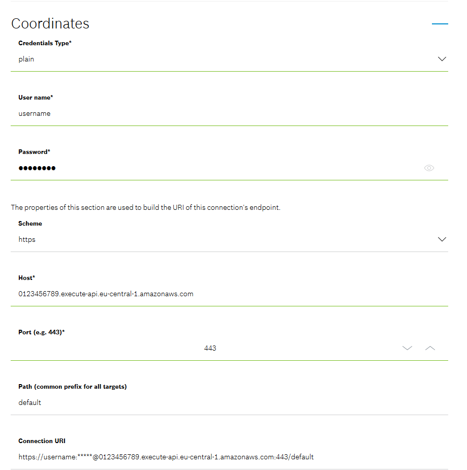
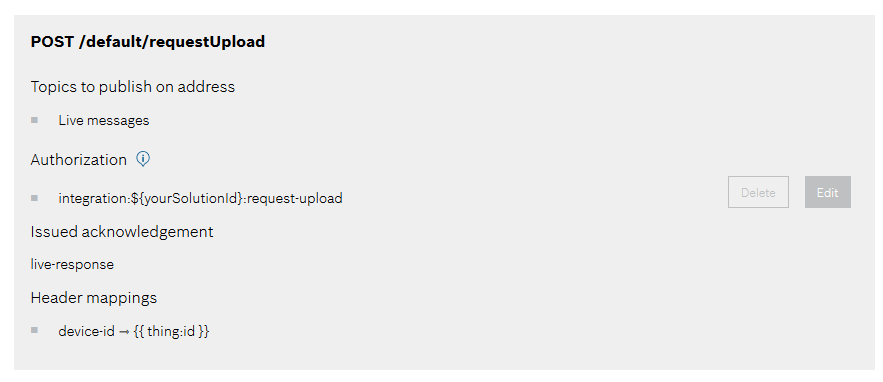
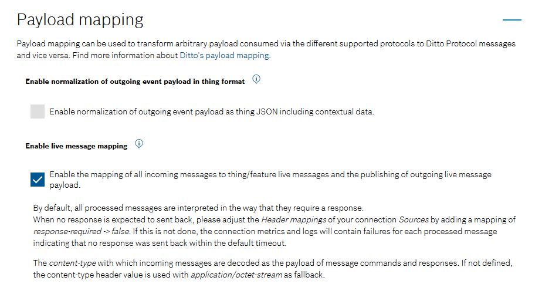

# File Upload by device

This example shows how to enable a device to upload files to an AWS S3 Bucket without the need of the device to know
about AWS. The device authentication is guaranteed by the Bosch IoT Hub and all the device needs to know about the S3
bucket is a [pre-signed URL](https://docs.aws.amazon.com/AmazonS3/latest/userguide/ShareObjectPreSignedURL.html) which
is provided by a generic command that is sent to the device.

## Architecture

TODO: Add image and short description here.

## Vorto Model

This is a simple Vorto model which defines a stateless process for uploading files.

```
vortolang 1.0
namespace vorto.private.poc.blob.upload
version 1.0.0
displayname "BLOBUpload"
description "Functionblock for BLOBUpload"

functionblock BLOBUpload {

  events {

    requestUpload {
      blobId as string
      blobType as string
      additionalInfo as dictionary[string, string]
    }

    success {
      blobId as string
      uploadURL as string
      additionalInfo as dictionary[string, string]
    }

    failed {
      blobId as string
      errorCode as string
      errorMessage as string
      additionalInfo as dictionary[string, string]
    }

    progress {
      blobId as string
      progressInfo as string
      additionalInfo as dictionary[string, string]
    }

  }

  operations {
     triggerUpload(blobId as string, uploadURL as string, additionalInfo as dictionary[string, string]) "Device should perform the upload to specified upload endpoint"
  }
}
```

## AWS Lambda

To provide a pre-signed URL to the device we create an AWS Lambda which handles an HTTP POST request containing the
payload of the `requestUpload` event. In our example we use `application/json` payload.

Let's assume the following payload:

```
{
    "blobId": "sample.png",
    "blobType": "PNG",
    "additionalInfo": {}
}
```

The Lambda will respond with the payload of the `triggerUpload` operation.

```
{
    "uploadURL": "https://file-upload.s3.eu-central-1.amazonaws.com/...",
    "blobId": "foo",
    "additionalInfo": {}
}
```

TODO: Add Lambda Code

## Configuration in IoT Things

Now that we have the Lambda, it's time to interact with it. In the following we'll provision a new device and create an
HTTP Webhook to the AWS Lambda. The last step will be to configure a payload mapping in the connection to IoT Hub which
will transform the response of the AWS Lambda into a`triggerUpload` operation.

### Provision the Device

TODO: show device provisioning via developer console

#### Policy

In Bosch IoT Things the `requestUpload` event is modelled as live message according to
the [documentation](https://docs.bosch-iot-suite.com/asset-communication/Specification-digital-twin-model-mapping.html#src-1352239526_Specificationdigitaltwinmodelmapping-Digitaltwinfacetevents)
.

This message will be sent by the device and needs to be published to the AWS Lambda. This means that we should configure
an additional entry in the Policy of the Device we just provisioned. This could for example be done by using
the [HTTP API of Bosch IoT Things](https://apidocs.bosch-iot-suite.com/?urls.primaryName=Bosch%20IoT%20Things%20-%20API%20v2#/Policies/put_policies__policyId__entries__label_)
. In this example we add an entry called `REQUEST_UPLOAD` which looks like this (please replace `${yourSolutionId}` with
ID of your Bosch IoT Things Solution):

```
{
    "subjects": {
        "integration:${yourSolutionId}:request-upload": {
            "type": "request-upload live message"
        }
    },
    "resources": {
        "message:/features/BLOBUpload/outbox/messages/requestUpload": {
            "grant": [
                "READ"
            ],
            "revoke": []
        }
    }
}
```

### Webhook to the AWS Lambda

The Webhook to the Lambda can be established by configuring an HTTP connection within Bosch IoT Things.

1. Create a new HTTP connection and give it some expressive name. In this case we've chosen "Lambda".
   
2. Configure the connection with the URL and credentials of your Lambda.
   
3. Add a target which uses HTTP POST to publish Live messages to the `/requestUpload` endpoint of your Lambda. Use the
   authorization subject we defined in the Policy Entry earlier (`integration:${yourSolutionId}:request-upload`). To
   provide the `device-id` header with the correct ID of the device specify a header
   mapping `device-id ⇾ {{ thing:id }}`.
   
4. Last but not least we need to enable the live message mapping. This will extract the payload of the live message and
   publishes only the payload to the Lambda.
   

### IoT Hub Connection

## Device?
