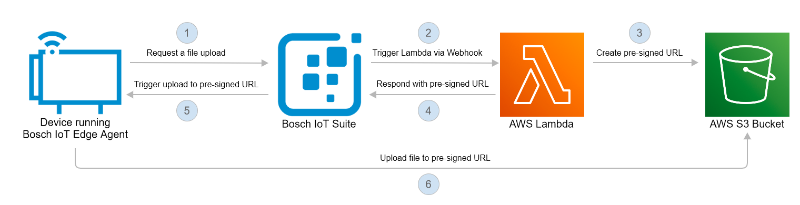

# File upload by device

This example shows how to enable a device to upload files to an AWS S3 bucket without the need of the device to know
about AWS. The device authentication is guaranteed by the Bosch IoT Suite. 
Everything the device needs to know about the S3
bucket is a [pre-signed URL](https://docs.aws.amazon.com/AmazonS3/latest/userguide/ShareObjectPreSignedURL.html), which
is provided by a generic command that is sent to the device.



**Table of contents**

* [Vorto model](#vorto-model)
* [AWS Lambda](#aws-lambda)
    * [AWS setup](#aws-setup)
        * [Create S3 bucket](#create-s3-bucket)
        * [Create Lambda function](#create-lambda-function)
        * [Configure Lambda function](#configure-lambda-function)
        * [Create a policy to access the S3 bucket](#create-a-policy-to-access-the-s3-bucket)
        * [Attach the policy to the Lambda role](#attach-the-policy-to-the-lambda-role)
        * [(Optional) Test Lambda function](#optional-test-lambda-function)
* [Configure the Bosch IoT Suite](#configure-the-bosch-iot-suite)
    * [Provision the device](#provision-the-device)
    * [Update the policy of the device](#update-the-policy-of-the-device)
    * [Configure the Webhook to the AWS Lambda](#configure-the-webhook-to-the-aws-lambda)
    * [Update the Bosch IoT Hub Connection](#update-bosch-iot-hub-connection)
* [Device](#device)
    * [Usage](#usage)
    * [Code overview](#code-overview)

## Vorto model

This is a simple Vorto model, which defines a stateless process for uploading files.

```
vortolang 1.0
namespace vorto.private.example.bosch.iot.suite.file.upload
version 1.0.0
displayname "BLOBUpload"
description "Functionblock for BLOBUpload"

functionblock BLOBUpload {

  events {

    requestUpload {
      blobId as string
      blobType as string
      additionalInfo as dictionary[string, string]
    }

    success {
      blobId as string
      uploadURL as string
      additionalInfo as dictionary[string, string]
    }

    failed {
      blobId as string
      errorCode as string
      errorMessage as string
      additionalInfo as dictionary[string, string]
    }

    progress {
      blobId as string
      progressInfo as string
      additionalInfo as dictionary[string, string]
    }

  }

  operations {
     triggerUpload(blobId as string, uploadURL as string, additionalInfo as dictionary[string, string]) "Device should perform the upload to specified upload endpoint"
  }
}
```

## AWS Lambda

To provide a pre-signed URL to the device we create an AWS Lambda, which handles the HTTP POST request containing the
payload of the `requestUpload` event. In our example, we use an `application/json` payload.

Let's assume the following payload:

```
{
    "blobId": "sample.png",
    "blobType": "PNG",
    "additionalInfo": {}
}
```

The Lambda will respond with the payload of the `triggerUpload` operation.

```
{
    "uploadURL": "https://file-upload.s3.eu-central-1.amazonaws.com/...",
    "blobId": "foo",
    "additionalInfo": {}
}
```


### AWS Setup

In this section we set up and configure the Lambda function, 
so it is ready to serve requests and provision pre-signed URLs for an S3 bucket.

#### Create S3 bucket

In this section we create the S3 bucket, where all uploads will be stored.

1. Go to https://s3.console.aws.amazon.com/s3 and create a new bucket with a name of your choice.
2. Use the default settings; this will create a **private** bucket. 
   The policy to grant access to upload files will be created in a later section.


#### Create Lambda function

The following steps create the boilerplate Lambda function using JavaScript and leveraging Node.js.

1. Go to https://eu-central-1.console.aws.amazon.com/lambda
2. Choose `Create function`
3. Take `Use a blueprint` and select `microservice-http-endpoint` (tags: `nodejs`, `api-gateway`)
4. Go to the next page with `Configure`
5. Configure the function
    * Set a function name in this example it is `requestUpload`
    * Choose `Create a new role with basic Lambda permissions`
    * API Gateway trigger: 
      * `Create an API`
      * API type `HTTP API`
      * Security: `Open` (we will add our own security later on), 
      * Other settings on defaults
6. Choose `Create function`; we will adapt the code in the next step.
   
#### Configure Lambda function

Now we add the actual source code for handling requests and generating the pre-signed URL.

1. Replace the current content of the Lambda function in `index.js` 
   with the [provided JavaScript code](src/lambda/index.js).
2. Adapt line 7 with your S3 bucket name:
   ```javascript
   const s3bucket = "bucket-name";
   ```
3. Deploy the current version
4. Below the source code go to `Environment Variables` and choose `Edit`
   * Generate or use a strong `password` for the authorization (e.g. with `openssl rand -base64 32`)
   * Choose a `username`
   * Add an environment variable with the key `AUTHORIZATION` and the value in basic auth format:
   `Basic Base64(<username>:<password>)`, for example: `Basic cG9jOnNlY3JldA==`
5. Retrieve the Lambda HTTP endpoint information by choosing the `API Gateway` in the Designer view, 
   expanding the details and checking the `API endpoint`.
   

#### Create a policy to access the S3 bucket

In this section we create a policy, which allows uploading to a specific S3 bucket. 
This policy will be attached to the role of the Lambda.
The pre-signed URLs will therefore only be valid for this specific S3 bucket.

1. Go to https://console.aws.amazon.com/iam/home?#/policies
2. Create a new policy
3. Use the following settings:
   * Service: `S3`
   * Actions: `Write > PutObject`
   * Resources: 
       * Select `Add ARN`
       * Bucket name: the S3 bucket name
       * Object name: check `Any`
4. Skip the next page (adding tags)
5. In the last step, give the policy a name, e.g. _file-upload-write-only_
6. In the policy summary, verify the policy.<br> 
   
   
#### Attach the policy to the Lambda role

1. Go to https://console.aws.amazon.com/iam/home?#/roles
2. Find and select the Lambda role. It should start with the lambda name (e.g. `RequestUpload-role-...`)
3. Choose `Attach policies`
4. Find and select the policy created above by searching for its name or by filtering for customer managed policies
5. Choose `Attach policy`

#### (Optional) Test Lambda function

Everything is now configured for a first test.<br> 
Use `curl` to retrieve a pre-signed URL from the Lambda endpoint to upload a file. 
Note that the URL is configured to expire after one hour [see line 73 of index.js](src/lambda/index.js)

* Replace `{LambdaEndpoint}` and `{Authorization}` with the actual 
  lambda endpoint and the credentials from the section [Configure Lambda function](#configure-lambda-function).
* Run (you can optionally adapt the `device-id`)
   ```bash
   curl --location --request POST "{LambdaEndpoint}" \
   --header 'Device-Id: namespace-1:device-2' \
   --header 'Authorization: {Authorization}' \
   --header 'Content-Type: application/json' \
   --data-raw '{
   "blobId": "sample.png",
   "blobType": "PNG",
   "additionalInformation": {}
   }'
   ```
* The response should be something like
    ```json
    {
       "uploadURL":"https://bucket-name.s3.eu-central-1.amazonaws.com/...",
       "blobId":"sample.png",
       "additionalInfo":{}
    }
    ```
* The `uploadURL` can be used to test the upload:
   ```bash
   curl --location --request PUT "https://bucket-name.s3.eu-central-1.amazonaws.com/..." \
   --header 'Content-Type: text/plain' \
   --data-raw 'test-content'
   ```
* If you don't get any error, the upload was done successfully.<br> 
  You can now check the successful upload in the S3 bucket under the key `namespace-1:device-2/sample.png`

## Configure the Bosch IoT Suite

Now that we have the Lambda, it's time to interact with it.<br> 
In the following, we'll provision a new device and create an
HTTP Webhook to the AWS Lambda. The last step will be to configure a payload mapping in the connection to 
Bosch IoT Hub. 
The connection will transform the response of the AWS Lambda into a `triggerUpload` operation.

### Provision the device

To provision the device follow the [Provision a Linux-based device](https://docs.bosch-iot-suite.com/edge/index.html#110336.htm) steps from [Bosch IoT Edge documentation](https://docs.bosch-iot-suite.com/edge/#108408.htm).

#### Update the policy of the device

In Bosch IoT Things, the `requestUpload` event is modelled as a live message according to
the [specification](https://docs.bosch-iot-suite.com/asset-communication/Specification-digital-twin-model-mapping.html#src-1352239526_Specificationdigitaltwinmodelmapping-Digitaltwinfacetevents).

This message will be sent by the device and needs to be published to the AWS Lambda. This means that we should configure
an additional entry in the policy of the device we just provisioned. This could for example be done by using
the [HTTP API of Bosch IoT Things](https://apidocs.bosch-iot-suite.com/?urls.primaryName=Bosch%20IoT%20Things%20-%20API%20v2#/Policies/put_policies__policyId__entries__label_). 

In this example, we add an entry called `REQUEST_UPLOAD`, which looks like in the following snippet. <br>
Please replace `${yourSolutionId}` with the ID of your Bosch IoT Things instance.

```
{
    "subjects": {
        "integration:${yourSolutionId}:request-upload": {
            "type": "request-upload live message"
        }
    },
    "resources": {
        "message:/features/BLOBUpload/outbox/messages/requestUpload": {
            "grant": [
                "READ"
            ],
            "revoke": []
        }
    }
}
```

### Configure the Webhook to the AWS Lambda

Configure a new HTTP connection to establish connection to the Lambda Webhook using the Things UI.

1. Create a new HTTP connection and give it some expressive name. In this case we've chosen "Lambda".
   
2. Configure the connection with the URL and credentials of your Lambda.
   
3. Add a target which uses HTTP POST to publish _live messages_ to the `/requestUpload` endpoint of your Lambda.<br>
   Make sure to use exactly the same authorization subject as defined in the policy entry earlier <br>
   (`integration:${yourSolutionId}:request-upload`). <br>
   To provide the `device-id` header with the correct ID of the device specify a header
   mapping `device-id ⇾ {{ thing:id }}`.
   
4. Last but not least we need to enable the payload mapping for the live message. <br>
   This will extract the payload of the _live message_ and will publish only the payload to the Lambda.
   

### Update Bosch IoT Hub Connection
The `Devices via Bosch IoT Hub` connection is the channel where Bosch IoT Things receives messages 
sent from the device and publishes messages to the device.
In order to make the response of the AWS lambda look like a `triggerUpload` operation, you well need
to add a custom JavaScript-based payload mapping.
Please edit the connection with the name `Devices via Bosch IoT Hub` which is created automatically, 
after booking a Bosch IoT Suite for Device Management package.


The **incoming** script expects the messages to be in Ditto Protocol format. It parses both, textual payload and binary payload, as Ditto Protocol message.

```
/**
 * Maps the passed parameters to a Ditto Protocol message.
 * @param {Object.<string, string>} headers - The headers Object containing all received header values
 * @param {string} [textPayload] - The String to be mapped
 * @param {ArrayBuffer} [bytePayload] - The bytes to be mapped as ArrayBuffer
 * @param {string} [contentType] - The received Content-Type, e.g. "application/json"
 * @returns {(DittoProtocolMessage|Array<DittoProtocolMessage>)} dittoProtocolMessage(s) -
 *  The mapped Ditto Protocol message,
 *  an array of Ditto Protocol messages or
 *  <code>null</code> if the message could/should not be mapped
 */
function mapToDittoProtocolMsg(
  headers,
  textPayload,
  bytePayload,
  contentType
) {

  let dittoProtocolMsg = null;
  if (contentType === 'application/vnd.eclipse.ditto+json') {
    // Used if a ditto protocol message is sent as text payload.
    dittoProtocolMsg = JSON.parse(textPayload);
  } else if (contentType === 'application/octet-stream') {
    // Used if a ditto protocol message is sent as binary payload.
    dittoProtocolMsg = JSON.parse(Ditto.arrayBufferToString(bytePayload));
  }
  // If not if-clause matched, the message is still be null and will be dropped.
  return dittoProtocolMsg;
}
```
The script for **outgoing** messages adds a special handling for the response to the 
`requestUpload` message. It transforms the response to a `triggerUpload` live message.

```
/**
 * Maps the passed parameters which originated from a Ditto Protocol message to an external message.
 * @param {string} namespace - The namespace of the entity in java package notation, e.g.: "org.eclipse.ditto"
 * @param {string} id - The ID of the entity
 * @param {string} channel - The channel for the signal, one of: "twin"|"live"
 * @param {string} group - The affected group/entity, one of: "things"
 * @param {string} criterion - The criterion to apply, one of: "commands"|"events"|"search"|"messages"|"errors"
 * @param {string} action - The action to perform (one of: "create"|"retrieve"|"modify"|"delete"),
 * or the subject of a message
 * @param {string} path - The path which is affected by the message (e.g.: "/attributes"), or the destination
 * of a message (e.g.: "inbox"|"outbox")
 * @param {Object.<string, string>} dittoHeaders - The headers Object containing all Ditto Protocol header values
 * @param {*} [value] - The value to apply / which was applied (e.g. in a "modify" action)
 * @param {number} status - The status code that indicates the result of the command.
 * @param {Object} extra - The enriched extra fields when selected via "extraFields" option.
 * @returns {(ExternalMessage|Array<ExternalMessage>)} externalMessage -
 *  The mapped external message,
 *  an array of external messages or
 *  <code>null</code> if the message could/should not be mapped
 */
function mapFromDittoProtocolMsg(
  namespace,
  id,
  group,
  channel,
  criterion,
  action,
  path,
  dittoHeaders,
  value,
  status,
  extra
) {

  let dittoProtocolMessage;  

  if(action === "requestUpload") {
    // Transform the response of a "requestUpload" message to a "triggerUpload" operation.
    let newAction = "triggerUpload";
    let newPath = "/features/BLOBUpload/inbox/messages/triggerUpload";
    let newDittoHeaders = {
      'x-things-parameter-order' : dittoHeaders['x-things-parameter-order']
    };
    let newStatus = undefined; // Initialize with undefined to avoid having a status in the "triggerUpload" message
    dittoProtocolMessage = Ditto.buildDittoProtocolMsg(namespace, id, group, channel, criterion, newAction, newPath, newDittoHeaders, value, newStatus, extra);
  } else {
    dittoProtocolMessage = Ditto.buildDittoProtocolMsg(namespace, id, group, channel, criterion, action, path, dittoHeaders, value, status, extra);
  }
 
  let headers = {};
  let textPayload = JSON.stringify(dittoProtocolMessage);
  let bytePayload = null;
  let contentType = 'application/vnd.eclipse.ditto+json';

  return Ditto.buildExternalMsg(headers, textPayload, bytePayload, contentType);
}
```
## Device

On the device we have a Go program ([blob-upload.go](src/device/blob-upload.go)) that implements 
the BLOBUpload Vorto feature. It communicates with the Bosch IoT Hub through the 
local MQTT broker of the Bosch IoT Edge Agent. 

The program demonstrates the simplest use case. 
* It sends a `requestUpload` message for a single file specified with the `-f` command-line flag, 
* and listens for the `triggerUpload` response. 
* Upon receiving it, the provided pre-signed URL is used to upload the file, after which the program exits. 

Adding events for upload progress, success or failure is left as an exercise for the reader ;-).

We use the [Eclipse Ditto Client SDK for Golang](https://github.com/eclipse/ditto-clients-golang) 
for communication over the Ditto protocol.

### Usage

To run/build the program [Go](https://golang.org/doc/install) v1.15+ is required.

Execute the following command in [src/device](src/device) directory to run the program:

```
go run . -f <path-to-file>
```

Alternatively, you can first build the program to executable and then run it: 

```
go build .

.\blob-upload -f <path-to-file>
```

The program takes two command-line flags. 

* The file to be uploaded is specified with the mandatory `-f` flag. 
* The URI of the MQTT broker provided with the Bosch IoT Edge Agent can be specified with the optional `-b` flag.<br> 
  If omitted it defaults to `tcp://edgehost:1883`.

### Code overview

Following is an overview of [blob-upload.go](src/device/blob-upload.go) functions

* `func init()` initializes the `filePath` and `mqttBrokerURI` variables from the command-line flags and checks if the specified file exists.

* `func main()` 
  * uses `fetchDeviceInfo()` to fetch the `deviceID` and `tenantID` from the Bosch IoT Edge Agent
  * initializes the `dittoClient` with the `mqttBrokerURI`, `connectHandler` and `messageHandler` functions are set as handlers
  * the program waits on the `chstop` channel for exit signal. The signal may come from the system (SIGINT/SIGTERM signals) or the program itself - after the file is successfully uploaded.

* `func connectHandler(client *ditto.Client)` - upon connect, it creates the BLOBUpload feature and calls `sendUploadRequest(filePath, client)` with the `filePath` variable initialized in the `init()` function

* `func sendUploadRequest(filePath string, client *ditto.Client)` - sends `requestUpload` message for the given `filePath`

* `func messageHandler(requestID string, msg *protocol.Message)` - upon receiving `triggerUpload` message, 
   it calls `uploadFile(filePath, urlStr)` function with the file path and pre-signed URL from the message

* `func uploadFile(filePath string, urlStr string)` - uploads the given file using the provided pre-signed URL with a PUT HTTP request. If the upload is successful, writes to the `chstop` channel to trigger program exit

* `func fetchDeviceInfo() (string, string)` - fetches device and tenant IDs from the Bosch IoT Edge Agent. <br>
   For details see [Receive local Thing parameters](https://docs.bosch-iot-suite.com/edge/index.html#109655.htm)
